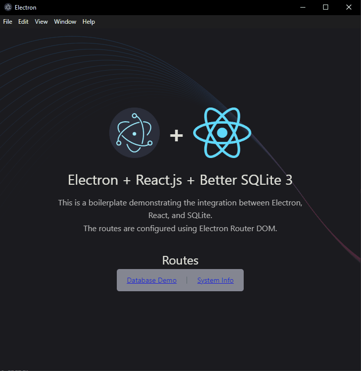
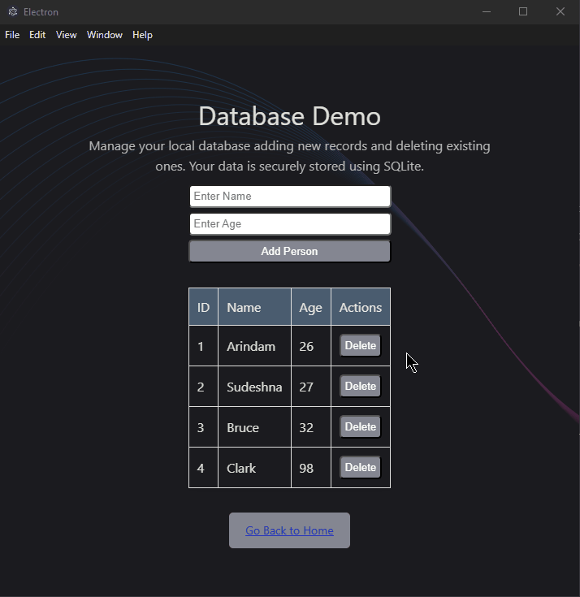
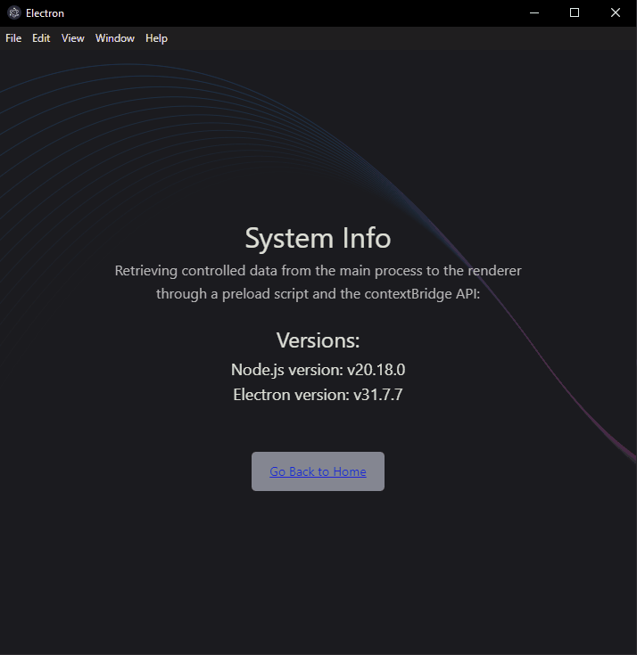

# Boilerplate React + Electron

## 📌 About the Project
This is a ready-to-use boilerplate that integrates React.js, Electron and Better SQLite 3, providing an optimized setup for development and production.

## ⚡ Features
- 🚀 Ready-to-use development and production setup
- 📱 Window routing using `electron-router-dom`
- 🌐 Support for query strings between the main and renderer processes
- 🗄️ Configured `better-sqlite3` database
- 🔧 Simplified integration between React.js and Electron using `electron-vite`

## 📸 Screenshots

Here are some screenshots of the application:

### 🏠 Home Page  


### 🗂️ Database Page  


### ⚙️ System Info Page  


## 📋 Minimum Requirements
- **Node.js** v18+
- **npm** v9+

## 🚀 Getting Started
```bash
git clone git@github.com:your-username/electron-react-sqlite-boilerplate.git
cd electron-react-sqlite-boilerplate
npm install
```

### 💻 Development Environment
```bash
npm run dev
```

### 📦 Build the Application
#### Windows:
```bash
npm run build:win
```
#### Linux:
```bash
npm run build:linux
```
#### MacOS:
```bash
npm run build:mac
```

The installer is generated in the `dist` directory.

## License

This project is licensed under the MIT License - see the [LICENSE](LICENSE) file for details.